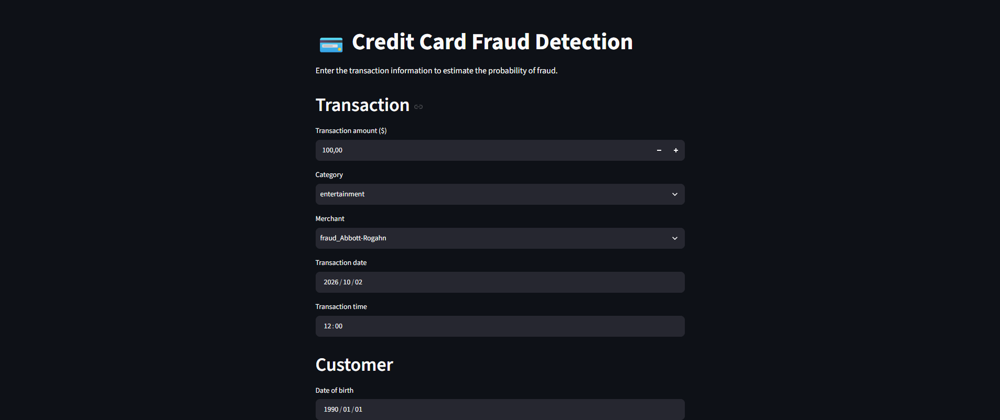
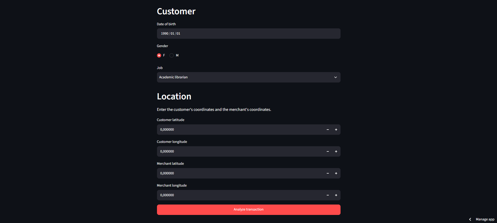
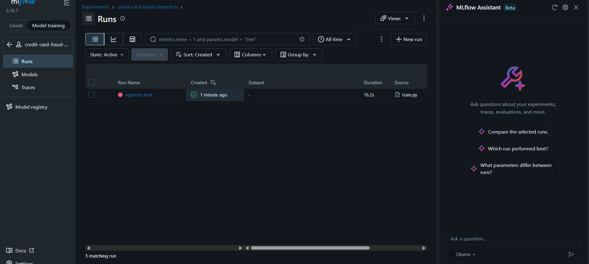
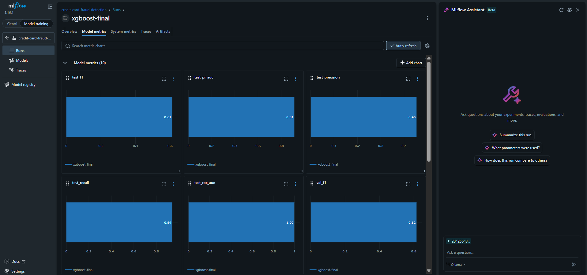

# 💳 Credit Card Fraud Detection 2.0

[](https://credit-card-fraud-detection-20-6vwd79nw7eb3rtanxw8b6f.streamlit.app/)

End-to-end Machine Learning project focused on detecting fraudulent credit card transactions and evolving a traditional ML workflow into a production-oriented application.

The original objective of the project was to build a machine learning model capable of detecting fraudulent transactions in a highly imbalanced dataset.

Version 2.0 extends that work beyond model training by integrating the trained pipeline into an application and progressively introducing production-oriented technologies such as Streamlit, FastAPI, Docker, and MLflow.

---

## 🎯 Project Objective

Credit card fraud detection is a highly imbalanced classification problem: fraudulent transactions represent only a small fraction of all transactions.

The objective of this project is to develop a machine learning system capable of identifying potentially fraudulent transactions while maintaining a reasonable balance between detecting fraud and limiting false positives.

The project also explores how a traditional machine learning workflow can evolve into a more production-oriented system.

### Project Evolution

```text
Traditional ML workflow
        ↓
Data analysis & feature engineering
        ↓
Model experimentation
        ↓
Threshold optimization
        ↓
Reusable model artifact
        ↓
Streamlit application        ← complete
        ↓
FastAPI inference API        ← complete
        ↓
Docker containerization      ← complete
        ↓
MLflow experiment & model tracking  ← complete
```

---

## 🖥️ Live Demo

🚀 **[Try the app here](https://credit-card-fraud-detection-20-6vwd79nw7eb3rtanxw8b6f.streamlit.app/)**




---

## 📊 Dataset

The project uses the Credit Card Fraud Detection dataset available on Kaggle.  
The cleaned dataset contains approximately 1.3 million transactions, with fraudulent transactions representing approximately 0.58% of the dataset.  
The original dataset is not included in this repository.

Dataset source: [Kaggle — Credit Card Fraud Detection](https://www.kaggle.com/datasets/kartik2112/fraud-detection)

---

## 🧠 Machine Learning Approach

The machine learning workflow includes:

- Data inspection and cleaning
- Exploratory Data Analysis (EDA)
- Feature engineering
- Stratified train/validation/test split
- Categorical feature encoding
- XGBoost model training
- Feature-set comparison
- Decision threshold optimization
- Final model training
- Error analysis
- Model artifact creation
- Application integration

### 🔧 Feature Engineering

Several features were derived from the original transaction data:

- `age` — derived from date of birth
- `hour` — derived from transaction timestamp
- `distance_km` — geographic distance between customer and merchant, calculated using the Haversine formula

The final model uses the following eight features:

| Feature | Type |
|---|---|
| `amt` | Numerical |
| `category` | Categorical |
| `merchant` | Categorical |
| `hour` | Numerical |
| `age` | Numerical |
| `gender` | Categorical |
| `job` | Categorical |
| `distance_km` | Numerical |

Categorical variables are transformed using a sparse `OneHotEncoder`, while numerical variables are passed directly to the model.

> A dense one-hot encoding approach initially caused a memory allocation error due to the size and dimensionality of the dataset. The preprocessing pipeline was redesigned using sparse matrices, allowing the model to be trained without materializing the entire encoded dataset as a dense array.

---

## 🌲 Model

The final classification model is an **XGBoost classifier**.

Several feature configurations were evaluated during the modeling process. The selected pipeline combines:

- Transaction information
- Customer profile information
- Transaction hour
- Customer-to-merchant geographic distance

The model uses `scale_pos_weight` to account for the strong class imbalance.

---

## 🎚️ Decision Threshold Optimization

The default classification threshold of 0.5 was not treated as a fixed decision boundary.

Different thresholds were evaluated on the validation set to analyze the trade-off between precision and recall. The test set remained isolated from this process and was only used for the final evaluation.

**Selected threshold: `0.75`**

This threshold produced the best F1-score among the tested validation thresholds.

---

## 📈 Final Test Results

The final model was evaluated on a previously unseen test set containing **194,502 transactions**.

| Metric | Test Result |
|---|---|
| ROC-AUC | **0.9958** |
| PR-AUC | **0.8791** |
| Precision | **87.39%** |
| Recall | **78.15%** |
| F1-Score | **82.51%** |

**Confusion Matrix**

```
                  Predicted
               Legitimate   Fraud
Actual
Legitimate       193,249      127
Fraud                246      880
```

The test set contained **1,126 fraudulent transactions**.  
Because the dataset is highly imbalanced, accuracy is not used as the primary evaluation metric.

---

## 🖥️ Streamlit Application

The trained machine learning pipeline is integrated into a Streamlit application that allows a user to enter transaction information and obtain a fraud probability.

**Inference flow:**

```text
User input
    ↓
Input validation
    ↓
Feature engineering (age, hour, distance_km)
    ↓
Model preprocessing (sparse OneHotEncoder)
    ↓
XGBoost prediction
    ↓
Fraud probability
    ↓
Threshold 0.75
    ↓
Final classification
```

The same preprocessing and model pipeline generated during training is reused during inference — this avoids duplicating the preprocessing logic between the notebook and the application.

---

## 📦 Model Artifact

The trained model is stored as a serialized artifact: `models/fraud_detection_pipeline.joblib`

The artifact contains:

- `model` — trained XGBoost classifier
- `threshold` — optimized decision threshold (0.75)
- `features` — list of input features
- `category_values` — valid values for categorical inputs

This allows the application to load the complete inference configuration without retraining the model.

---

## ⚡ FastAPI Inference API

The model is exposed as a REST API built with FastAPI, separating the inference logic from the user interface.

**Endpoints:**

| Method | Endpoint | Description |
|---|---|---|
| `GET` | `/health` | Returns API status and model load state |
| `POST` | `/predict` | Accepts transaction data, returns fraud probability and classification |

**Run the API locally:**

```bash
uvicorn api.main:app --reload
```

Interactive documentation available at: `http://localhost:8000/docs`

---

## 🐳 Docker

The application is containerized using Docker Compose, running two isolated services simultaneously.

| Service | Technology | Port |
|---|---|---|
| Inference API | FastAPI + Uvicorn | 8000 |
| Interactive App | Streamlit | 8501 |

**Run both services with a single command:**

```bash
docker compose up --build
```

---

## 📊 MLflow Experiment Tracking

All training runs are tracked using MLflow, logging parameters, metrics, and model artifacts for full reproducibility.




**Tracked parameters:** features, threshold, scale_pos_weight, XGBoost hyperparameters  
**Tracked metrics:** ROC-AUC, PR-AUC, Precision, Recall, F1 — on both validation and test sets  
**Tracked artifacts:** serialized model pipeline (.joblib)

**Run a new training experiment:**

```bash
python train.py
```

**View experiment results:**

```bash
mlflow ui --backend-store-uri sqlite:///mlflow.db --port 5001
```

Open `http://localhost:5001` to explore runs, compare metrics, and access model artifacts.

---

## 🏗️ Production-Oriented Evolution

| Stage | Technology | Status |
|---|---|---|
| Interactive interface | Streamlit | ✅ Complete |
| Inference API | FastAPI | ✅ Complete |
| Containerization | Docker | ✅ Complete |
| Experiment tracking | MLflow | ✅ Complete |

---

## 🛠️ Technologies

**Machine Learning**
- Python 3.12, Pandas, NumPy, Scikit-learn, XGBoost

**Application & API**
- Streamlit, FastAPI, Uvicorn, Joblib

**Production Stack**
- Docker, Docker Compose, MLflow

**Data Analysis & Visualization**
- Matplotlib, Seaborn

---

## 📁 Project Structure

```
Credit-card-fraud-detection-2.0/
│
├── data/
│   └── processed/
│       └── fraud_clean.csv
│
├── notebooks/
│   └── modeling.ipynb
│
├── models/
│   └── fraud_detection_pipeline.joblib
│
├── app/
│   ├── app.py
│   └── utils.py
│
├── api/
│   ├── __init__.py
│   ├── main.py
│   └── schemas.py
│
├── assets/
│   ├── app_screenshot_1.png
│   ├── app_screenshot_2.png
│   ├── mlflow_experiment.png
│   └── mlflow_metrics.png
│
├── train.py
├── mlflow.db
├── Dockerfile.api
├── Dockerfile.streamlit
├── docker-compose.yml
├── requirements.txt
├── README.md
└── .gitignore
```

---

## 🚀 How to Run

**Streamlit app:**
```bash
pip install -r requirements.txt
streamlit run app/app.py
```

**FastAPI:**
```bash
uvicorn api.main:app --reload
```

**Docker (both services):**
```bash
docker compose up --build
```

**MLflow training + UI:**
```bash
python train.py
mlflow ui --backend-store-uri sqlite:///mlflow.db --port 5001
```

---

## 🔮 Roadmap

- [x] Exploratory Data Analysis
- [x] Feature Engineering
- [x] Model experimentation
- [x] Feature-set comparison
- [x] Threshold optimization
- [x] Final model training
- [x] Error analysis
- [x] Model artifact creation
- [x] Streamlit application
- [x] Deployment
- [x] FastAPI inference API
- [x] Docker containerization
- [x] MLflow experiment tracking
- [x] Production-oriented architecture

---

## 👤 Author

**Geronimo Fernandez**  
Data Scientist | Machine Learning Enthusiast  
[LinkedIn](https://www.linkedin.com/in/geronimo-fernandez/) · [GitHub](https://github.com/GeronimoFernandez)

---

## 📄 License

This project is licensed under the MIT License.
